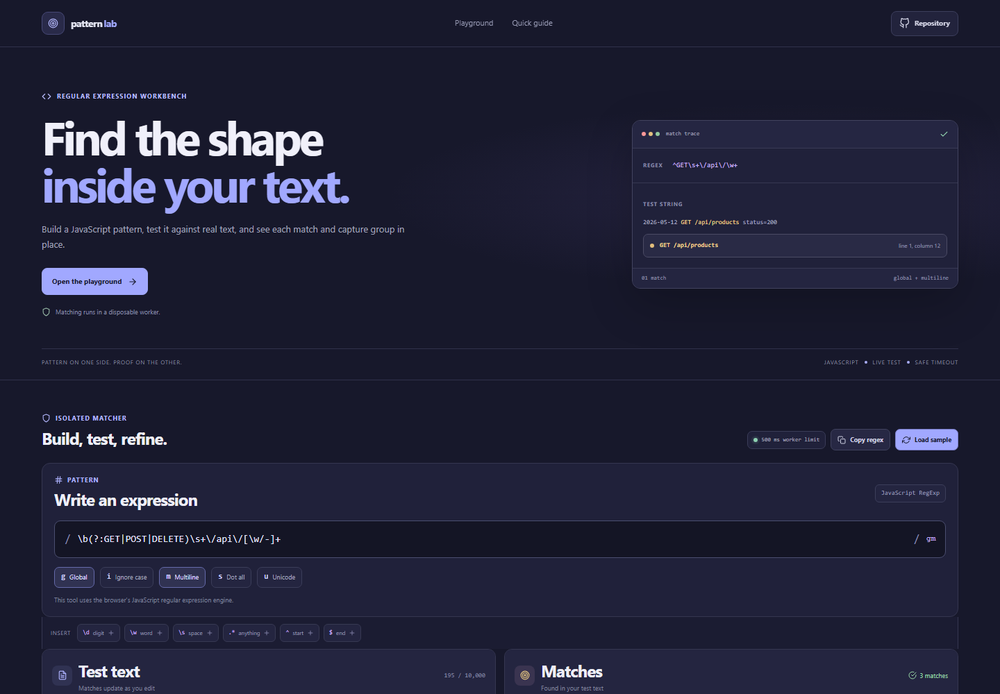



# Regex Playground

A focused JavaScript regular expression workbench for building a pattern, testing it against sample text, and reviewing matches, captures, and positions. The live matcher runs in a disposable Web Worker so a slow expression does not block the editor.

**Live app:** [https://a2rp.github.io/regex-playground/](https://a2rp.github.io/regex-playground/)

## What you can do

- Edit a JavaScript regular expression and enable global, ignore-case, multiline, dot-all, and Unicode flags.
- Insert common tokens such as `\d`, `\w`, `\s`, `.*`, `^`, and `$` at the current cursor position.
- Edit the test text and see matching results update automatically after a short debounce.
- Review each match with its full text, one-based line and column, character range, numbered captures, and named captures.
- Copy the expression as a JavaScript regex literal with its enabled flags.
- Load the built-in example after confirming that it will replace the current pattern and test text.
- See invalid pattern errors, empty matches, and when the result list has been capped.

## Limits and behavior

The editor accepts up to 10,000 characters of test text. Results stop after 500 matches so a large input cannot create an unbounded result list. Matching happens in a separate module worker. If that worker takes longer than 500 milliseconds, it is terminated and a timeout message is shown. The worker is created again when the pattern, flags, or test text changes.

Patterns follow the JavaScript `RegExp` syntax supported by the browser. Global matching returns every non-overlapping match; without the global flag, only the first match is returned. Empty matches advance safely, including with Unicode mode. The tool does not save edits: the pattern, flags, and test text live only in the current page session, and loading the sample replaces them after confirmation.

## Run locally

Use Node.js 20.19+ or 22.12+ and npm.

```sh
npm install
npm run dev
```

Open the local URL printed by Vite. Run the checks and production build with:

```sh
npm test
npm run lint
npm run build
```

Publish the current build to GitHub Pages with:

```sh
npm run deploy
```

The `deploy` script runs the production build first and publishes `dist` to the `gh-pages` branch. The Vite base path is configured for `https://a2rp.github.io/regex-playground/`.

## Future improvements

These are ideas and are not implemented yet:

- Add a replace panel with replacement previews and capture references.
- Add shareable, URL-encoded patterns and test cases.
- Add an optional library of editable examples for common tasks.

## Links

- Portfolio: [https://www.ashishranjan.net](https://www.ashishranjan.net)
- GitHub: [https://github.com/a2rp](https://github.com/a2rp)
- CodePen: [https://codepen.io/ash1198](https://codepen.io/ash1198)
- LinkedIn: [https://www.linkedin.com/in/aashishranjan](https://www.linkedin.com/in/aashishranjan)
- Facebook: [https://www.facebook.com/theash.ashish/](https://www.facebook.com/theash.ashish/)
- YouTube: [https://www.youtube.com/@ashishranjan-ashz?sub_confirmation=1](https://www.youtube.com/@ashishranjan-ashz?sub_confirmation=1)
- Email: [mailto:ash.ranjan09@gmail.com](mailto:ash.ranjan09@gmail.com)

## Support

- Support: [https://a2rp-donation-page.netlify.app/](https://a2rp-donation-page.netlify.app/)
- Buy Me a Coffee: [https://buymeacoffee.com/ashishranjan](https://buymeacoffee.com/ashishranjan)
- Patreon: [https://www.patreon.com/ashishranjan](https://www.patreon.com/ashishranjan)
